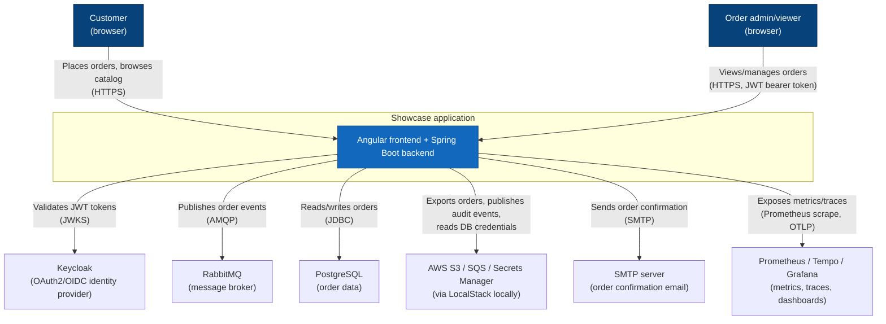
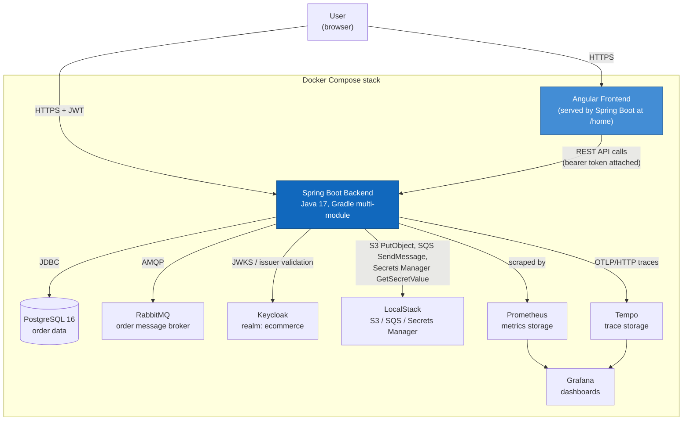
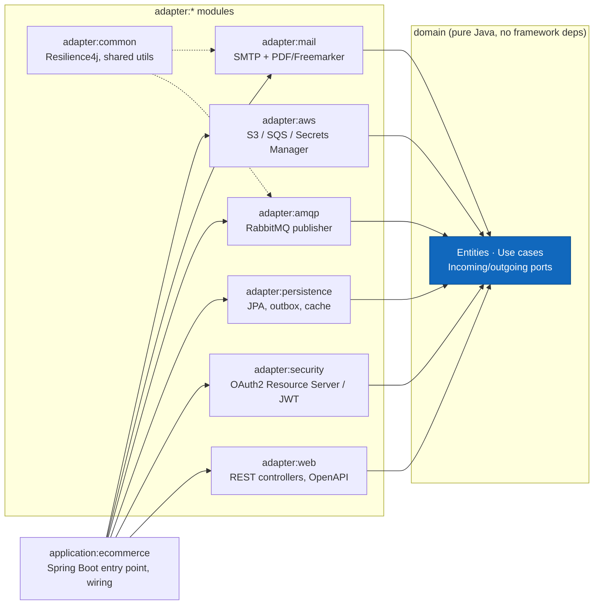

# Architecture diagrams

C4-style diagrams (context, container, and component level) for the e-commerce showcase, rendered
as Mermaid so they display directly on GitHub. See also the [ADRs](../adr/README.md) for the
reasoning behind the key decisions shown here.

## System context

Who/what interacts with the system, and which external systems it depends on.

## Containers

The deployable units that make up the system (matches `docker-compose.yml` at the repo root).

## Backend module structure (hexagonal architecture)

How the Gradle modules map to ports & adapters (see [ADR 0001](../adr/0001-hexagonal-architecture.md)).

